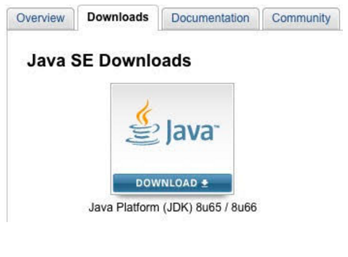
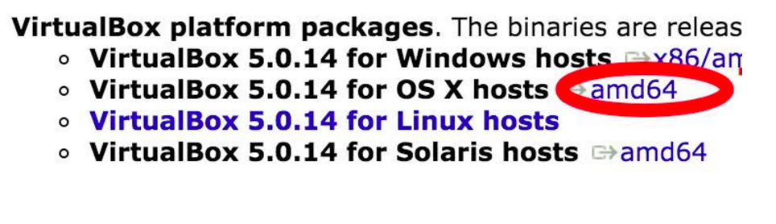
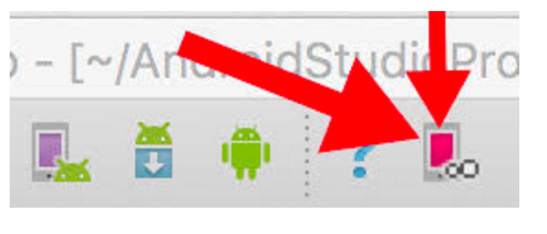

#  Software Installation Guide

This guide will get you setup and ready for the first day of the course. We will walk you through installing all the required software.

Required Software:
- [**Java Development Kit (JDK)**](#jdk)
- [**IntelliJ IDE**](#intellij)
- [**Android Studio**](#studio)
- [**Genymotion**](#genymotion)
- [**Virtual Box**](#virtualbox)
- [**Link Genymotion and Android Studio**](#linkgenymotiontostudio)
- [**Xcode**](#xcode)

***

<h3 id="jdk"></h3>
#### JDK Installation

We need the Java Development Kit (JDK) in order to run and compile Java code, and thus our Android Applications.

If you already have the JDK installed, you can skip this step.

###### Installation Steps

1. Head over to the [download](http://www.oracle.com/technetwork/java/javase/downloads/index.html) link. 

2. On the web page, click on the Downloads tab (see the picture below). 

3. There, select your operating system (for Mac its Mac OSX x64) and make sure to accept the Terms & Agreements. 

4. Open the downloaded `.dmg` file and follow the installation steps. 

5. Finally, lets make sure the JDK was installed correctly. Open the terminal application on your computer (you can find this by searching for "terminal" using Spotlight - Command plus Space keys - on your Mac). Once terminal has loaded, type in `java -version` and hit enter. Java version should have popped up as 1.8 or greater, which means you did it! If not, try going back to step one and repeat the process.

***

<h3 id="intellij"></h3>
#### IntelliJ IDE Installation

We need IntelliJ in order to practice Java Fundementals. While Android Studio is a highly customized version of IntelliJ, it does not allow us to write pure Java code and adds unnecessary distraction while you are getting comfortable with Java.

###### Installation Steps

1. Download [IntelliJ](https://www.jetbrains.com/idea/)

2. Follow the installation instructions on the web page.

***

<h3 id="studio"></h3>
#### Android Studio Installation

We need Android Studio because it is the *primary* development tool for Android Applications. Android studio is a highly customized version of IntelliJ IDE and was created by Google for you, the Android Developer.

###### Installation Steps

1. Download [Android Studio](http://developer.android.com/sdk/index.html). You'll have to agree to the Terms & Conditions before you can download Android Studio.

2. Launch the downloaded `.dmg` file. You will see a popup window, drag and drop Android Studio into your applications folder.

3. Open up Android Studio and follow the onscreen setup steps. You should be able to click next on the Welcome screen. For Java settings, choose Standard installation type. Accept the SDK License and Intel-Android-Extra-License. Click finish, and just wait for the downloads to complete!

***

<h3 id="genymotion"></h3>
#### Genymotion Installation

We need Genymotion to run and test our Android Applications on the computer, without using a physical device. While Android Studio provides an Emulator, Genymotion is superior to it in terms of performance.

###### Installation Steps

1. Sign up for an [account](https://www.genymotion.com/account/create/). For company size, choose *Personal Use*, and for Usage type choose *Training*. Fill out the rest of the form and you should receive an e-mail with a confirmation link. That link should send you to a landing page. Click continue and choose a plan. Then, select the *Individual* tab. Choose the basic plan by selecting get started, and you will be given a download link for your device.

2. Use the download link to download the software.

3. Open the downloaded `.dmg` file. Complete the installation, and make sure to drag both icons in the popup into your application folder!

***

<h3 id="virtualbox"></h3>
#### VirtualBox Installation

We need VirtualBox to get our Genymotion Emulator working. If you open Genymotion now, it will give you an error message and stop working. This is because Genymotion requires another piece of software called VirtualBox in order to function. 

VirtualBox is a cross-platform virtualization application. You can [read](https://www.virtualbox.org/manual/ch01.html) more about what VirtualBox is and how it works.

###### Installation Steps

1. [Download](https://www.virtualbox.org/wiki/Downloads) from the web page. You will have to click on the *amd64* link to the right of your operating system (see the image below circling what to click). 

2. Open the downloaded `.dmg` file and run the `.pkg`. Follow the installation instructions, and then open the application. 

3. Try to open your Genymotion Application. It should work. If it does not, repeat the installation steps.

***

<h3 id="linkgenymotiontostudio"></h3>
#### Linking Genymotion and Android Studio 

We need to link Genymotion and Android Studio together using a plugin created by the developers of Genymotion. This will allow us to launch any Genymotion installed device image Emulator form within Android Studio. This in turn, will allow us to run our Android Applications on this Emulator.

###### Installation Steps

1. Open Android Studio Application.

2. At the top, find settings menu for *Android Studio -> Preferences*. From there, go to the *Plugin* tab on the left. Click browse repositories. It might be faded out at first, but don’t worry! Type in *Genymotion* in the top search bar and select it in the list below. On the right you will see a description with a green install button. Click it to install the plugin. When installation completes, you will be prompted to restart Android Studio. Make sure you agree and restart Android Studio.

3. Once your Android Studio has restarted, you should see a new button on the top of your toolbar, as seen in the picture below:

4. Click on the new button. It might open a prompt for you to enter the path to your Genymotion app, which you should be able to find in your Applications folder if you dragged it in there during the installation process. Select the Genymotion App, and hit the blue button to confirm. Your Genymotion should now be connected. 

5. You can open up the Genymotion app and download one of the existing devices using the `+` button. Once a device image is downloaded and installed, you can run it inside Android Studio using the Genymotion button!

***

<h3 id="xcode"></h3>
#### Xcode Installation

We need Xcode because it will give us access to tools, specifically Git. This section only applies to those who are using the *recommended* Macbook laptop.

###### Installation Steps

1. Find and download the *Xcode* application in the App Store. It is a large program, so the download and installation time will take a while. 

2. Go through the setup process and open the Xcode application at least once to make sure it works.

***

